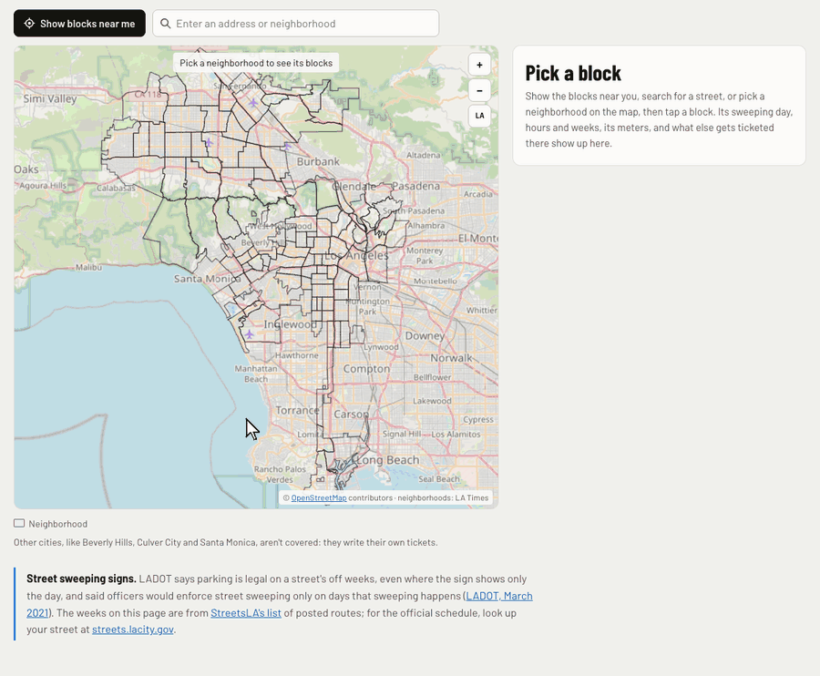
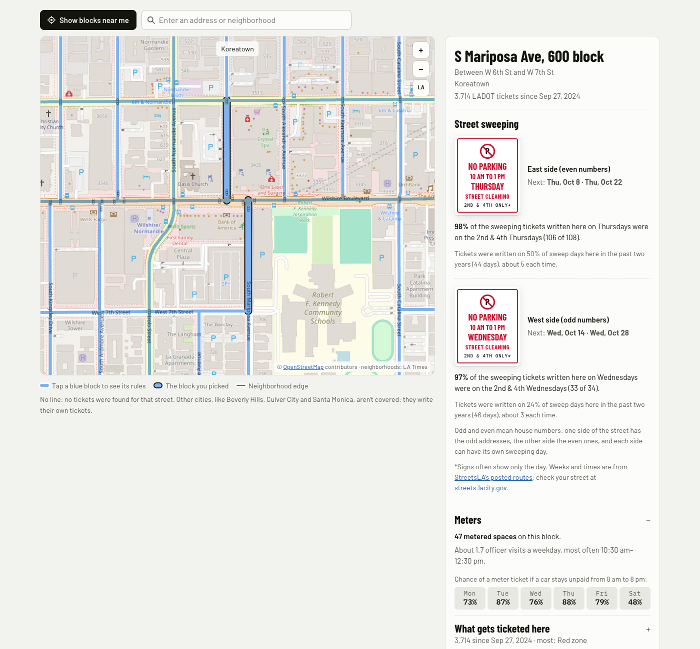
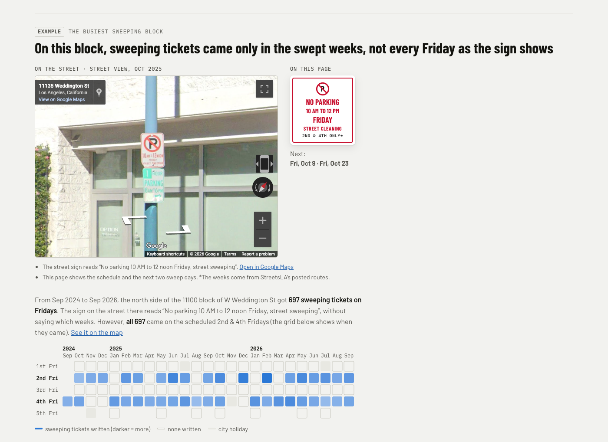
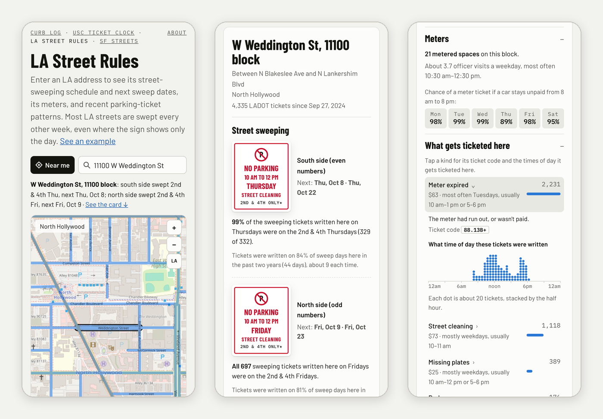
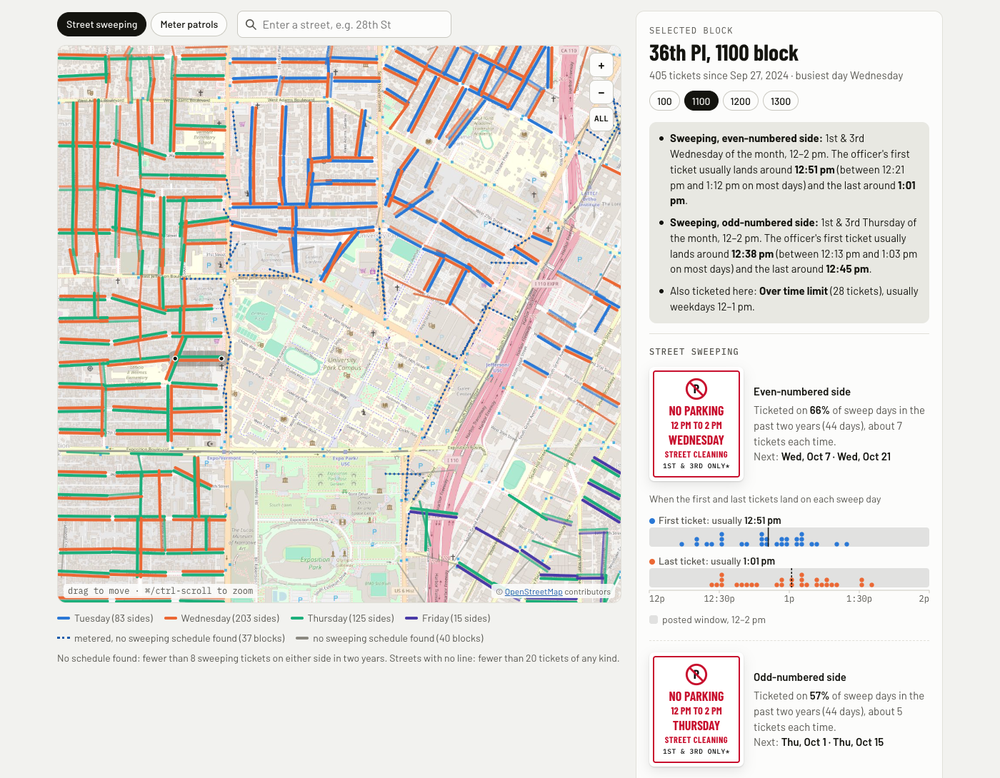

# LA Street Rules & USC Ticket Clock

**[LA Street Rules](https://citina.github.io/la-streets/streets/)** is a map of the City of Los Angeles that answers,
for any block:

- **When is it swept?** The day, hours and weeks of the month for each side of the street, and the next sweep dates.
- **Is it metered,** and how often do meter officers come by?
- **What else gets ticketed here,** what does it cost, and at what time of day?

Most LA streets have been swept every other week since 2021, like the 2nd & 4th Thursdays of the month, but many signs
still say just "No parking Thursday". LADOT's tickets show when enforcement actually comes, one ticket at a time. LA
Street Rules reads the last two years of them (about 3.9 million), matches most of them by address to one of about
48,000 blocks, and takes each side's sweeping weeks and times from StreetsLA's posted routes. It's rebuilt every week.

**[USC Ticket Clock](https://citina.github.io/la-streets/)** is where it started: the streets around campus, in more
detail, down to when the sweeping officer usually shows up.


*Search a block and the card shows each side's sweeping sign and next dates. Then open its meters and what gets
ticketed there, and tap a kind of ticket to see what time of day it's written.*

## Look up a block


*S Mariposa Ave, 600 block, in Koreatown: the east side is swept on the 2nd & 4th Thursdays and the west side on the
2nd & 4th Wednesdays. It has 47 metered spaces, and the card gives the chance of a meter ticket by day.*

Find a block by searching a street, an address or a neighborhood, by picking a neighborhood on the map and tapping a
block, or with "Show blocks near me". The card shows:

- **Street sweeping, per side:** the schedule drawn as a sign (day, hours, and 1st & 3rd or 2nd & 4th weeks), the
  next two sweep dates, how many of the block's sweeping tickets came in those weeks, and how often a sweep day there
  actually got ticketed.
- **Meters:** the number of metered spaces, about how many times a weekday an officer comes by and when, and the
  chance of a ticket for a car left unpaid from 8 am to 8 pm, Monday to Saturday.
- **What gets ticketed here:** every kind of ticket written on the block in the last two years, with the fine and the
  usual days and hours. Tap one for its ticket code and a chart of the time of day.

## Many sweeping signs don't say which weeks


*The north side of the 11100 block of W Weddington St in North Hollywood. The sign on the street reads "No parking
10 AM to 12 noon Friday", without saying which Fridays. The grid below it has one square per Friday for two years: the
sweeping tickets came on the 2nd & 4th Fridays, the weeks StreetsLA posts for this street.*

## On a phone


*After a search, a one-line answer shows above the map (each side's weeks and next sweep day), with a link down to
the card.*

## USC Ticket Clock


*36th Pl, 1100 block, next to campus. On the map, each side of each street is colored by its sweeping day.*

USC Ticket Clock covers a 2.5 × 2.5 km box around University Park, with about 318,000 tickets since 2014. Pick a block
and it shows:

- **Street sweeping, per side:** the posted day and window, the weeks, the next dates, and when the officer's first
  and last tickets usually land, down to the minute, with one dot per sweep day.
- **Meter patrols:** how often an officer walks by, and the odds of a ticket if you don't pay, by arrival time and
  length of stay, half hour by half hour, in USC class weeks.
- **Everything else ticketed there,** with the fine and the usual time of day.

Below the map, a summary for the whole area: every-other-week sweeping, when the officers arrive, and the three waves
of meter patrols a day.

## Not 100% accurate

Everything here is built automatically from LADOT's tickets and StreetsLA's posted routes, which can be late or miss
changes, so always read the posted signs. It isn't a guide to parking illegally: past tickets don't predict the next
one, an officer can come by at any time, and a quiet hour in the data can still end in a ticket. A ticket only shows up
when someone broke a rule, so quiet blocks look less enforced than they are. Each page explains its numbers under "How
this was measured".

**Sweeping signs.** LA has swept each street every other week since March 2021 (the 1st & 3rd or the 2nd & 4th time
its weekday comes up in a month), but many signs were never updated and still show only the day. LADOT says parking is
legal on a street's off weeks
([Larchmont Chronicle, March 2025](https://larchmontchronicle.com/to-adhere-to-parking-signs-or-not-to-adhere/)),
and when the change began it said officers would enforce street sweeping only on days that sweeping happens
([LADOT, March 2021](https://ladot.lacity.gov/dotnews/weekly-update-march-4-2021)). The days, weeks and times on both
pages come from [StreetsLA's list](https://www.arcgis.com/home/item.html?id=0e16fa641a0846a3ae29bffb150314dc) of posted
routes; only which side of a street gets which day is worked out from the tickets. To check your own street, look it up
at [streets.lacity.gov](https://streets.lacity.gov/services/street-sweeping).

## How it's built

Two hand-written pages with no map library: the maps are SVG over OpenStreetMap tiles.

- **LA Street Rules** is [`docs/streets/index.html`](docs/streets/index.html), with no build step. `fetch_city.py`
  downloads two years of city-wide tickets, the city's street centerlines, LADOT's meter inventory and StreetsLA's
  posted sweeping routes. `analyze_city.py` matches each ticket's address to a block and side, works out each block's
  rules, and splits the blocks into small map cells that load as you zoom in, plus a search index.
  `neighborhoods.py` writes `docs/streets/hoods.json`, the LA Times' neighborhood outlines (committed; rerun it only if
  they change).
- **USC Ticket Clock** is [`template.html`](template.html). `analyze.py` writes every number it shows to
  `data/bundle.json`, `basemap.py` stitches the OpenStreetMap basemap, and `build.py` puts them together into one
  self-contained `docs/index.html` (never edit that file by hand).
- `citations.py` holds what both share: address parsing, street-name cleanup, holidays, USC term dates, the posted
  sweeping routes and ticket-kind names.

On LA Street Rules, the map images come from OpenStreetMap and the block data from GitHub Pages, one small area at a
time, so both can tell roughly which part of the city you're looking at. "Show blocks near me" only moves the map; the page doesn't send or
save your location.

**Weekly update.** Every Monday, [`.github/workflows/weekly.yml`](.github/workflows/weekly.yml) reruns both pipelines
on GitHub Actions. LA Street Rules' data (about 16 MB of JSON) isn't committed: it goes to the `city-data` release,
overwritten each week, and `pages.yml` unpacks it into `docs/streets/data/` when it publishes. The raw downloads are
kept in the `city-downloads` release, so a run refreshes only the recent ticket months, a few older ones, and the
street centerlines once a month; if a city server is down, it keeps the older copy. The USC job commits the new
`data/bundle.json` and `docs/index.html`. If the ticket count falls more than 10% (city) or 1% (USC), that job stops
and last week's page stays up. USC term dates in `citations.py` run through fall 2027; the run log warns once the newest
ticket is past them. To rebuild by hand, run `gh workflow run weekly.yml`.

## Run it

```
./fetch_city.py        # data/city/: two years of city-wide tickets (~450 MB), street centerlines, meter inventory, posted sweeping routes
./analyze_city.py      # docs/streets/data/ (~16 MB of JSON, not committed); serve docs/ and open /streets/
./neighborhoods.py     # docs/streets/hoods.json (committed; only rerun if the city updates the outlines)

./fetch_citations.py   # data/citations_usc.csv, data/meters_usc.csv, data/sweep_routes.geojson
./basemap.py           # docs/basemap.jpg (36 OpenStreetMap tiles at zoom 16, cached in .tilecache/)
./analyze.py           # data/bundle.json (every number the USC page shows)
./build.py             # docs/index.html
```

then `python3 -m http.server 8766 --directory docs` and open http://localhost:8766/streets/ (or `/` for USC Ticket
Clock). Python 3 with pandas, numpy, scipy and Pillow. The raw downloads and the tile cache aren't committed; they
regenerate from the commands above.

## Who made this

[Citina Liang](https://github.com/citina), a PhD candidate in Industrial & Systems Engineering at USC Viterbi who models
how people behave and how diseases spread, with Claude Code, from first commit to every block in the city in about a
week (9–16 Sep 2026). Say hi on [LinkedIn](https://www.linkedin.com/in/citina/) or at citina.liang@gmail.com.

Its sisters are [SF Streets](https://citina.github.io/sf-streets/), San Francisco block by block, and
[Curb Log](https://citina.github.io/curb-log/), available parking on Vermont Ave by W 36th St from LADOT's parking
sensors.

Map © [OpenStreetMap](https://www.openstreetmap.org/copyright) contributors. Data: LADOT Parking Citations and Metered
Parking Inventory ([data.lacity.org](https://data.lacity.org)), StreetsLA's Posted Street Sweeping Routes, and the
City of LA's street centerlines and the LA Times' neighborhood outlines ([LA GeoHub](https://geohub.lacity.org)).
